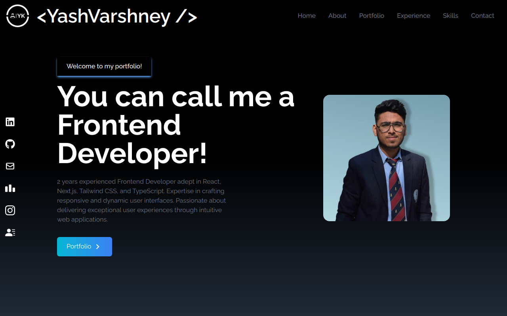

# My Developer Portfolio

## Introduction

Welcome to my personal developer portfolio! This website serves as a showcase of my work, skills, and journey as a developer. It's designed to give you insight into who I am and what I can do.

You can check out the live version [here](https://your-portfolio-url.com).

## About Me

With over 2 years of experience in frontend development, I bring a strong foundation in React, Next.js, Tailwind CSS, and TypeScript. I have worked on various projects, collaborating closely with cross-functional teams to deliver exceptional user experiences. Alongside my technical skills, I have a keen eye for design and a deep understanding of user-centric development. My goal is to create seamless digital experiences that leave a lasting impression.

## Projects

Here are some of the projects featured in my portfolio:

### Project 1: Drawpad
- Description: DrawPad is a collaborative drawing application that allows users to create and sketch in real-time with their teammates.
- Technologies Used: Next.js
- [Link to Project](https://drawpad-lovat.vercel.app/)

## My Journey

I'm currently a Frontend Developer at JULO. I previously worked at Innovaccer and earned my B.Tech degree from JIIT Noida. My academic journey began at RRK Sr. Sec School in Chandausi, where I completed my Class 10 and Class 12 studies.

## Technical Skills

List your technical skills and proficiencies. For example:

- Front-end Development: HTML, CSS, JavaScript, Typescript, React, Next.js, Tailwind, Redux
- Back-end Development: Node.js, Express.js
- Database: MongoDB
- Version Control: Git, GitHub
- Others: C++, Flutter, Responsive web design, Animations, React Testing Library, React-query, Jest, SCSS, Firebase, Problem Solving, DSA, Cypress, Mixpanel, Hive, Jira, Agile

## Contact Me

Feel free to reach out to me. You can contact me via email or through my social media profiles.

- Email: yvarshney44@gmail.com
- LinkedIn: [My LinkedIn Profile](https://www.linkedin.com/in/yash-varshney)
- GitHub: [My GitHub Profile](https://github.com/ykji)
